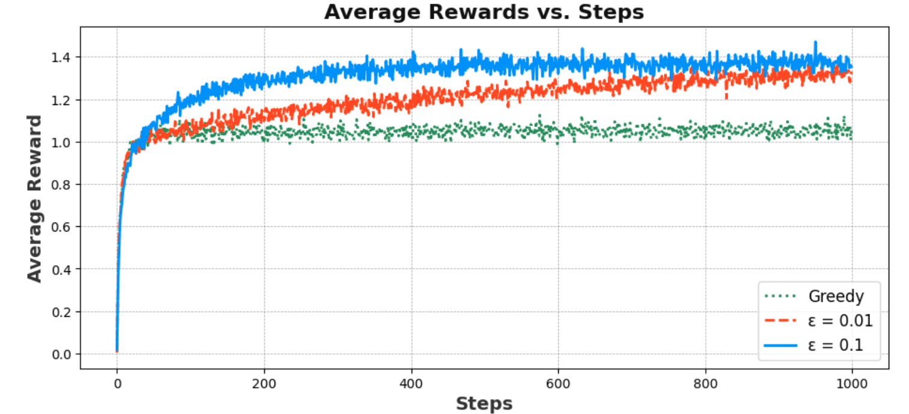
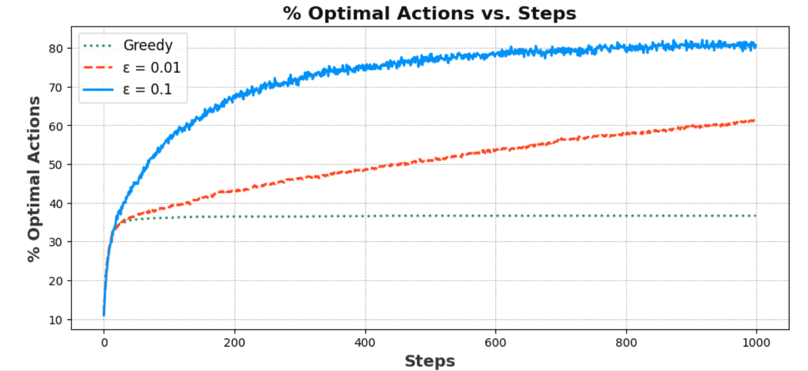
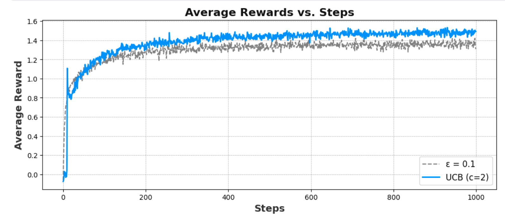

# 📘 **Multi-Armed Bandit Algorithms: A Performance Analysis**

## Table of Contents
- [Overview](#overview)
- [Simulating the 10-Armed Bandit Testbed](#simulating-the-10-armed-bandit-testbed)
- [Algorithms Implemented](#algorithms-implemented)
- [Performance Metrics](#performance-metrics)
- [Performance Graphs](#performance-graphs)
- [Insights and Comparison](#insights-and-comparison)

---

## 📘 **Overview**

This repository implements and analyzes **multi-armed bandit algorithms** on a simulated 10-armed bandit testbed. We evaluate different exploration-exploitation strategies, including:
- **Greedy**
- **ϵ-Greedy** with different values of ϵ
- **Upper Confidence Bound (UCB)**

Our goal is to compare their performance over time to understand the trade-offs in balancing exploration and exploitation.

---

## 🎯 **Simulating the 10-Armed Bandit Testbed**

- **Environment**: A 10-armed bandit, where each arm's true value $$q^*(a)$$ is sampled from a normal distribution $$N(0, 1)$$.
- **Reward Distribution**: Rewards for pulling arm $$a$$ are sampled from $$N(q(a), 1)$$.
- **Objective**: Maximize cumulative rewards over 1000 timesteps across 2000 simulations.

---

## 🔧 **Algorithms Implemented**

### 1. **Greedy Algorithm**
- Selects the arm with the highest estimated value.
- Exploitation-focused strategy that may converge prematurely to suboptimal arms.

### 2. **ϵ-Greedy Algorithm**
- Balances exploration and exploitation:
  - Explores randomly with probability $$\epsilon$$.
  - Exploits the current best arm with probability $$1 - \epsilon$$.
- Simulated for $$\epsilon = 0.1$$ and $$\epsilon = 0.01$$.

### 3. **Upper Confidence Bound (UCB)**
- Selects arms based on the sum of:
  - Estimated reward.
  - A confidence term that decreases as an arm is played more frequently.
- Provides a dynamic trade-off between exploration and exploitation.

---

## 📈 **Performance Metrics**

### **Key Metrics**
1. **Average Reward vs. Time**:
   - Tracks the average reward obtained across simulations at each timestep.
2. **% Optimal Actions vs. Time**:
   - Tracks the percentage of times the optimal action is selected at each timestep.

---

## 📊 **Performance Graphs**

### Graph 1: Average Reward vs. Time Steps for Greedy Algorithm

### Graph 2: % Optimal Actions vs. Time Steps for Greedy Algorithm

### Graph 3: Average Reward vs. Time Steps for Epsilon Greedy v/s UCB Algorithm

---

## ✨ **Insights and Comparison**

### **Greedy Algorithm**
- Strong initial performance due to exploitation.
- Plateaus quickly and performs poorly in long-term reward and optimal action selection.

### **ϵ-Greedy Algorithm**
1. **ϵ = 0.1**:
   - Balances exploration and exploitation effectively.
   - Achieves higher long-term rewards compared to greedy.
   - Selects the optimal action ~91% of the time.
2. **ϵ = 0.01**:
   - Slower initial learning but outperforms $$\epsilon = 0.1$$ in the long run.
   - Focuses more on exploitation after adequate exploration.

### **UCB (c=2)**
- Delivers the best performance by dynamically adjusting exploration.
- Initially slower due to equal exploration of all arms.
- Surpasses ϵ-Greedy in both metrics, emphasizing its ability to adapt based on confidence intervals.

---

## 📂 **File Structure**
- `simulating-the-multi-armed-bandit.ipynb`: Contains implementations of the bandit environment and explanation of algorithms.
- `README.md`: Overview and insights from the project.

---

## 🔗 **References**
- Sutton, R. S., & Barto, A. G. (2018). *Reinforcement Learning: An Introduction.*
